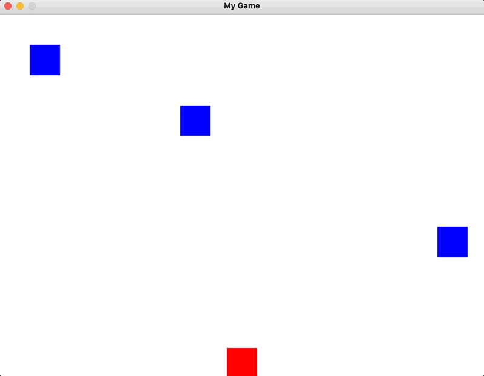

## This is a demonstration of how to develop a simple game using pygame module

The player's objective is to guide the red box towards the upper boundary of the wind while avoiding collisions with the blue boxes. The gameplay of this simple game is depicted in the following screen capture, which draws inspiration from the popular "Crossy Road" game.

Please note that the code in this repository has room for improvement and could be made more "Pythonic". We intentionally refrained from polishing the code in order to facilitate learning.

If you're new to game development and interested in starting with Python, we invite you to fork this repository and make modifications to the gameplay. Please create a new branch when pushing changes and use the following format for the branch name: "**yourGithubID-dev**". For example, my branch would be named madhawap-dev.

After you've made your modifications to the game, submit a pull request and we'll review it before adding it to the repository. This way, you can share your awesome game with your fellow colleagues.

